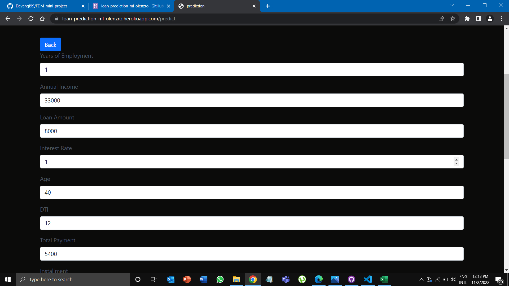

https://user-images.githubusercontent.com/88153883/214396009-b7b85f71-4a8a-40bd-8a61-4c4a70e34dda.mp4

# OlenzroBank_Loan-Prediction
This group project is related to the FDM module in 2nd semester of 3rd year. A Machine Learning model was developed to predict the risk of lending a loan to a customer, based on the related factors such as annual income, income category, age, house ownership, etc. . A historical data set from [Kaggle](https://www.kaggle.com/) was used as a source that contains important characteristics that were collected before lending the loan to customers. 

## Analyzing the dataset
- Step 01: Calculate the size of the dataset with number of features/attributes and check data types of the columns

- Step 02: Get an idea about columns and generate column names

- Step 03: Based on the observation of the dataset, plot a diagram to identify the correlation between the features

## Preprocessing data
- Step 01: Identify the null values in the dataset

- Step 02: Handle numerical missing data with mean and check null values replaced or not

- Step 03: Check duplicate values in the dataset

- Step 04: Change the attribute values to a meaningful manner to maintain the consistency between the fields of the training dataset and user inputs

- Step 05: Drop columns which are not related and less important

## Visualizing data
- Step 01: Check whether the categorical default or not based on loan condition. Furthermore, check the features with respect to target 

- Step 02: Get the plots to get a clear idea about how the features affect to the loan condition

- Step 03: Check numerical data with loan condition and remove outliers

## Handling the categorical data with OneHotEncoding

## Model development
- Step 01: Separate independent and dependent variables

- Step 02: Split training and testing data set

## Model training
- Logistic Regression, Random Forest Classifier and Decision Tree Classifier were trained and compared. 

- The team decided to go with the Random Forest model

- Feature importance 

## Model was deployed with Heroku

## Tools & technologies
- Language - Python
- IDE - Jupyter, Visual	Studio	Code
- Framework - Flask
- Server/Hosting - Heroku

